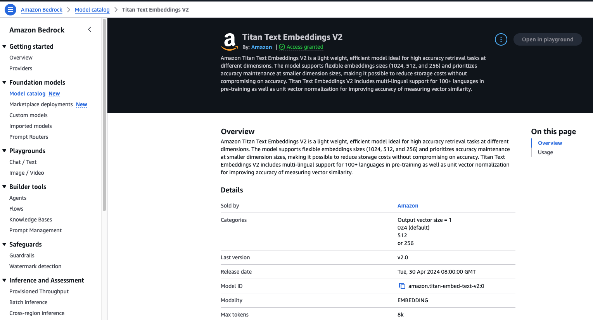
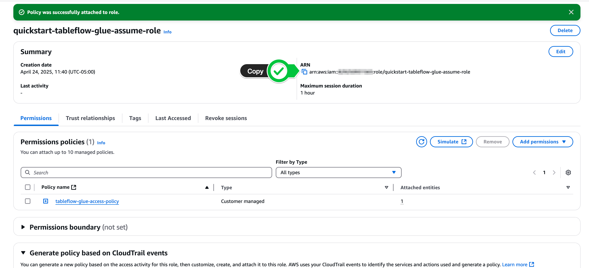

<div align="center" padding=25px>
    
</div>

# <div align="center">Quick Guide to setup Confluent cloud resources</div>
<br>

## Prerequisites

Use this [Link](https://www.confluent.io/get-started/?utm_campaign=tm.gc_name.q2-hands-on-workshop_id.701Uz00000YiZ1nIAF&utm_source=splash&utm_medium=landingpage) to Signup for Confluent Cloud.

Please pick region: **US-east-1** for both AWS and Confluent Cloud
***Confluent Cloud:***

    Use ANZ email +ai3
    e.g. xxx+ai3@anz.com

Promo code to bypass paywall (adding credit card details): **CONFLUENTDEV1**


## <a name="step-1"></a>Log into Confluent Cloud

1. Log into [Confluent Cloud](https://confluent.cloud) and enter your email and password.

<div align="center" padding=25px>
    
</div>

2. If you are logging in for the first time, you will see a self-guided wizard that walks you through spinning up a cluster. Please minimize this as you will walk through those steps in this workshop. 

***

## <a name="step-2"></a>Create an Environment and Cluster

An environment contains clusters and its deployed components such as Apache Flink, Connectors, ksqlDB, and Schema Registry. You have the ability to create different environments based on your company's requirements. For example, you can use environments to separate Development/Testing, Pre-Production, and Production clusters. 

1. Click **+ Add Environment**. Specify an **Environment Name** and Click **Create**. 

>**Note:** There is a *default* environment ready in your account upon account creation. You can use this *default* environment for the purpose of this workshop if you do not wish to create an additional environment.

<div align="center" padding=25px>
    
</div>

2. Now that you have an environment, click **Create Cluster**. 

> **Note:** Confluent Cloud clusters are available in 5 types: Basic, Standard, Enterprise , Dedicated and Freight. Basic is intended for development use cases so you will use that for the workshop. Basic clusters only support single zone availability. Standard , Enterprise, Dedicated and Freight clusters are intended for production use and support Multi-zone deployments. If you are interested in learning more about the different types of clusters and their associated features and limits, refer to this [documentation](https://docs.confluent.io/current/cloud/clusters/cluster-types.html).

3. Chose the **Basic** cluster type. 

<div align="center" padding=25px>
    
</div>

4. Click **Begin Configuration**. 
5. Choose AWS as preferred Cloud Provider, region (us-east-1), and availability zone. 
6. Specify a **Cluster Name**. For the purpose of this lab, any name will work here. 

<div align="center" padding=25px>
    
</div>

7. View the associated *Configuration & Cost*, *Usage Limits*, and *Uptime SLA* information before launching. 
8. Click **Launch Cluster**. 

***

## <a name="step-3"></a>Create a Flink Compute Pool

1. On the navigation menu, select **Flink** and click **Create Compute Pool**.

<div align="center" padding=25px>
    
</div>

2. Select **Region** and then **Continue**. (You have to use the region where the cluster was created in the previous step)
<div align="center" padding=25px>
    
</div>

3. Name you Pool Name and set the capacity units (CFUs) to **10**. Click **Finish**.

<div align="center" padding=25px>
    
</div>

> **Note:** The capacity of a compute pool is measured in CFUs. Compute pools expand and shrink automatically based on the resources required by the statements using them. A compute pool without any running statements scale down to zero. The maximum size of a compute pool is configured during creation. 

4. Flink Compute pools will be ready shortly. You can click **Open SQL workspace** when the pool is ready to use.

5. Change your workspace name by clicking **settings button**. Click **Save changes** after you update the workspace name.

<div align="center" padding=25px>
    
</div>

6. Set the Catalog as your environment name.

<div align="center" padding=25px>
    
</div>

7. Set the Database as your cluster name.

<div align="center" padding=25px>
    
</div>

***

## <a name="step-4"></a>Run the python producer to load data

1. Follow the steps [here](https://github.com/Mukul-conf/ANZ-AI-Days/tree/main/ANZ%20Gameday%20Resources/Producers#csv-to-kafka-streamer) to run the python producers which will create Topics for you.

***

## <a name="step-5"></a>Create an API Key

1. Open the cluster page.
2. Click **API Keys** in the menu under *Cluster Overview*.
3. Click **Create Key** in order to create your first API Key. If you have an existing API Key, click **+ Add Key** to create another API Key.

<div align="center" padding=25px>
    
</div>

4. Select **My account** and then click **Next**.
5. Enter a description for your API Key (e.g. `API Key to source data from connectors`).

<div align="center" padding=25px>
    
</div>

6. After creating and saving the API key, you will see this API key in the Confluent Cloud UI in the *API Keys* table. If you don't see the API key populate right away, try refreshing your browser.
***


## <a name="step-9"></a>Setting up aws bedrock

1. Enable access to AWS Bedrock LLama 3 8B Instruct model.
   Navigate to Amazon Bedrock, Model Catalog, Filter by Meta and search for LLama 3 8B Instruct.
   
<div align="center" padding=25px>
    
</div> 

 
2. Use confluent UI to create connection with bedrock. Navigate to integrations under environment.

<div align="center" padding=25px>
    
</div>

3. Navigate to connections and add connections.

<div align="center" padding=25px>
    
</div>

4. Copy the AWS Credentials from the AWS dashboard.

<div align="center" padding=25px>
    
</div>

>**Note:** Alternatively, you can create a new AWS user and assign the AmazonBedrockFullAccess policy and generate the Key and secret for this user. <br> <div align="center"></div>

5. Select Bedrock, add above AWS credentials and Bedrock endpoint URL:
    https://bedrock-runtime.us-east-1.amazonaws.com/model/meta.llama3-8b-instruct-v1:0/invoke
    
<div align="center" padding=25px>
    
</div>

6. After creating the connection, validate if the integration is created successfully.

<div align="center" padding=25px>
    
</div>

7. Use the same connection to create a model in flink.

```sql
CREATE MODEL RECOMMEND_BEDROCK
INPUT (`text` VARCHAR(2147483647)) 
OUTPUT (`output` VARCHAR(2147483647)) 
WITH ( 
    'bedrock.connection' = 'bedrock-connection', 
    'bedrock.system_prompt' = 'Generate a personalized movie recommendation message',
    'provider' = 'bedrock', 
    'task' = 'text_generation' 
    );
```


 <details>
      <summary><a name="step-10"></a> Embedding Generation using Flink & Bedrock (Optional)</summary>

The next step is to generate embeddings using Titan Model in AWS Bedrock.

1. First, navigate to AWS Bedrock Model Catalog and enable access to the Titan Model.
   
<div align="center" padding=25px>
    
</div>

2. Copy the AWS Credentials from the AWS dashboard.

<div align="center" padding=25px>
    
</div>

>**Note:** Alternatively, you can create a new AWS user and assign the AmazonBedrockFullAccess policy and generate the Key and secret for this user. <br> <div align="center"></div>

3. Navigate to Environments -> Integrations -> Connections and create a Bedrock integration. 
   Endpoint: https://bedrock-runtime.us-east-1.amazonaws.com/model/amazon.titan-embed-text-v2:0/invoke
 
<div align="center" padding=25px>
    
</div>

4. Validate if the connection is created successfully.

<div align="center" padding=25px>
    
</div>

5. Use the same connection to create a model in Flink.

```sql
CREATE MODEL RECOMMEND_BEDROCK_TITAN
INPUT (`text` VARCHAR(2147483647)) 
OUTPUT (`output` VARCHAR(2147483647)) 
WITH ( 
    'bedrock.connection' = 'bedrock-connection-titan', 
    'bedrock.input_format' = 'Generate a personalized movie recommendation message',
    'provider' = 'bedrock', 
    'task' = 'embedding' 
    );
```

6. Use the bedrock model to get embeddings from topic data

 </details>


# Steps to setup Tableflow with AWS S3 bucket
## Step 1: Navigate to Provider Integrations

1.  In your **Confluent Cloud** console, navigate to your Cluster: Environment > Your Environment > Your Cluster
2.  Click on **Tableflow** in the left-hand menu.
3.  Click on **View provider Integrations**.

    


---

## Step 2: Start Creating the *New* Provider Integration for Glue

**Important:** This creates a *separate* IAM Role and Provider Integration specifically for allowing Confluent Cloud to interact with your AWS Glue Data Catalog. It is *different* from the `s3-provider-integration` role used for writing data to S3.

1.  In the Provider Integrations section, click **+ Add Integration**.
2.  Choose to **create a new role** when prompted and click **Continue**.
3.  On the "Create Permission Policy in AWS" screen, ensure the Confluent Resource selected is **Tableflow Glue Catalog sync** (or similar wording indicating Glue access, *not* S3 access).
4.  **IMPORTANT:** Confluent Cloud will display a JSON permissions policy specifically for Glue access. **Copy this `permissions-policy.json`**. You will need it in the next step. Keep this Confluent Cloud wizard page open.


---

## Step 3: Create AWS IAM Policy for Glue Access

Use the policy JSON copied from the *Glue* wizard step to create an IAM policy in AWS.

1.  In your **AWS Management Console**, navigate to the **IAM** service.
2.  Click **Policies** -> **Create Policy**.
3.  Select the **JSON** tab.
4.  Paste the `permissions-policy.json` you copied in the previous step (specific to Glue access). *This policy grants permissions like `glue:GetDatabase`, `glue:CreateTable`, `glue:UpdateTable`, etc.*
5. Ensure you modify the Resource block to input your region (e.g. `us-east-2`) and account number.


6.  Click **Next** (or Next: Tags -> Next: Review).
7.  Give the policy a descriptive **Name**, like `tableflow-glue-access-policy`.
8.  Click **Create Policy**.
9.  Return to the **Confluent Cloud** provider integration wizard and click **Continue**.

---

## Step 4: Create AWS IAM Role for Glue Access (Initial)

Create a new IAM role in AWS that Confluent Cloud will assume *specifically for Glue access*.

1.  The Confluent Cloud wizard (for the Glue Provider Integration) should now display a **`trust-policy.json`** on the "Create role in AWS and map to Confluent" page. **Copy this `trust-policy.json`**. Keep the wizard open.
2.  In **AWS IAM**, navigate to **Roles** -> **Create role**.
3.  Select **Custom trust policy**.
4.  Paste the `trust-policy.json` you copied from the *Glue* Provider Integration wizard into the JSON editor.
5.  Click **Next**.
6.  On the **Add permissions** page, search for and select the IAM policy you created specifically for Glue access in Step 3 (e.g., `tableflow-glue-access-policy`).
7.  Click **Next**.
8.  Enter a **Role name** (distinct from your S3 role), e.g., `quickstart-tableflow-glue-assume-role`.
9.  Scroll down and click **Create role**.
10. After the role is created, view the role details and **copy its ARN**.



---

## Step 5: Complete Glue Provider Integration (Confluent & AWS)

Link the new Glue IAM role back to Confluent Cloud within the Provider Integration wizard.

1.  Return to the **Confluent Cloud** wizard for the Glue Provider Integration.
2.  Paste the **AWS Role ARN** for the *Glue access role* (copied in the previous step) into the appropriate field.
3.  Give this Glue-specific **Provider Integration** a **Name** (e.g., `glue-provider-integration`). Make a note of this name.
4.  Click **Continue**.
5.  **IMPORTANT:** Confluent Cloud will display an **updated Trust Policy JSON** (with the External ID) for the *Glue access role*. **Copy this entire updated `trust-policy.json`**.
6.  Go back to the **AWS IAM Role** you created specifically for Glue access (e.g., `quickstart-tableflow-glue-assume-role`).
7.  Select the **Trust relationships** tab and click **Edit trust policy**.
8.  **Replace the entire existing JSON** with the updated `trust-policy.json` (containing the External ID) you copied from Confluent Cloud.
9.  Click **Update policy**.
10. Return to the **Confluent Cloud** wizard and click **Continue** (or Finish/Create) to complete the Glue Provider Integration setup. You should now see `glue-provider-integration` listed in your Provider Integrations.

---

## Step 6: Create Catalog Integration

Now, create the Catalog Integration and link it to the Glue Provider Integration you just finished setting up.

1.  In your **Confluent Cloud** console, navigate to your Environment -> **Tableflow**.
2.  Scroll down to the **External Catalog Integration** section.
3.  Click **+ Add Integration**.
4.  For the integration type, select **AWS Glue** as the catalog.
5.  Provide a **Name** for this catalog integration instance, for example, `my-glue-catalog-integration`.
6.  In the section asking for the provider integration, **select the existing Glue Provider Integration** you created in the previous steps (e.g., `glue-provider-integration`) from the dropdown or list.
7.  Review the overall configuration for the AWS Glue Catalog Integration.
8.  Click **Launch** (or Continue/Create).

---

## Step 7: Verification (Glue Catalog)

1.  Monitor the status of the **Catalog Integration** (`my-glue-catalog-integration`) in the Confluent Cloud Tableflow UI. It should transition to **Connected** or **Running**.
2.  Navigate to the **AWS Glue Data Catalog** service in your AWS Console.
3.  Look for a new **Database** named after your Confluent Cloud Kafka Cluster ID (e.g., `lkc-xxxxxx`).
4.  Inside that database, you should start seeing **Tables** appearing with names corresponding to the Kafka topics you enabled Tableflow for in Lab 1 (e.g., `clicks`, `orders`).
5.  It might take a few minutes for the initial sync and table creation to occur.

---

## Step 8: Query Iceberg Tables with AWS Athena

Once the tables appear in AWS Glue, you can query them using Athena.

1.  **Navigate to Athena:**
    * In your **AWS Management Console**, navigate to the **Amazon Athena** service.
    * Ensure you are in the correct AWS region.

2.  **Configure Query Editor:**
    * In the Athena query editor, verify your **Workgroup** settings (the default `primary` workgroup is often sufficient, but ensure it has an S3 query result location configured).
    * For **Data source**, select **AwsDataCatalog**. This tells Athena to use your Glue Data Catalog.
    * For **Database**, select the database name that corresponds to your Kafka Cluster ID (e.g., `lkc-xxxxxx`), which you verified in Step 7.


3.  **Run Queries:**

    * ⚠️ Note: Configure the S3 result location in the settings. Use a bucket in the same region as your iceberg storage or same bucket with a different folder for results.
    
    

    * You can now run standard SQL queries against the tables registered in Glue. The table names will typically match your Kafka topic names.
    * **Example Queries:** Replace `<<logical-cluster-id>>` with the actual Glue database name and `<<topic-name>>` with the actual Glue table name (e.g., `clicks`, `orders`).

        ```sql
        -- See the first 10 records from a table
        SELECT *
        FROM "<<logical-cluster-id>>"."<<topic-name>>"
        LIMIT 10;

        -- Count the total number of records (will increase as Tableflow syncs)
        SELECT COUNT(*)
        FROM "<<logical-cluster-id>>"."<<topic-name>>";

        -- Example: Count records for a specific condition (if applicable to your schema)
        -- SELECT COUNT(*) as price_greater_than_50 
        -- FROM "<<logical-cluster-id>>"."orders" 
        -- where price > 50.00;
        ```
    * Type your query into the editor and click **Run**.

4.  **Analyze Results:**
    * The query results will appear in the **Results** pane below the editor.

**Important Note on Access Control:** As mentioned before, ensure the IAM principal (user or role) running Athena queries has read-only access to the Glue Data Catalog resources (database, tables) and the underlying S3 data location (`s3:GetObject` on `s3://<<Your S3 Bucket Name>>/*`). Avoid granting write permissions via Athena to data managed by Tableflow.

---

You have now successfully integrated Tableflow with your AWS Glue Data Catalog using a separate Provider Integration and queried the automatically created Iceberg tables using AWS Athena.

---


# Steps to add new users 

1. Go to Accounts and Access by Clicking on the right top Hamburger menue

<div align="center" padding=25px>
    
</div>

2. Click on **+Add Users**

<div align="center" padding=25px>
    
</div>

3. Add the email address of the person whom you want to add 

<div align="center" padding=25px>
    
</div>

4. On the next page Assign roles to the users on what they can access and click on confirm

<div align="center" padding=25px>
    
</div>

