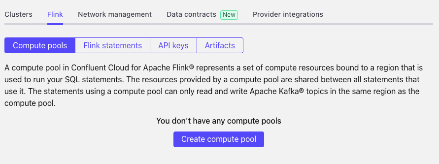
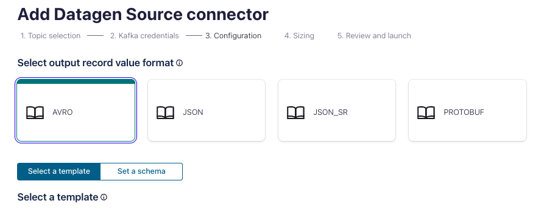
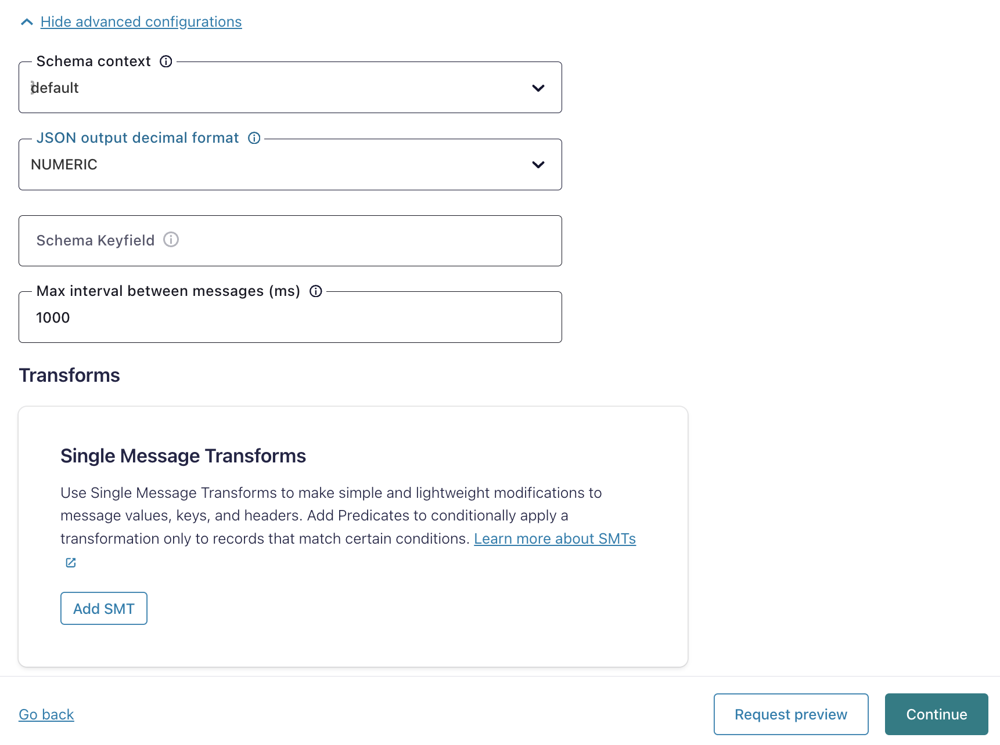
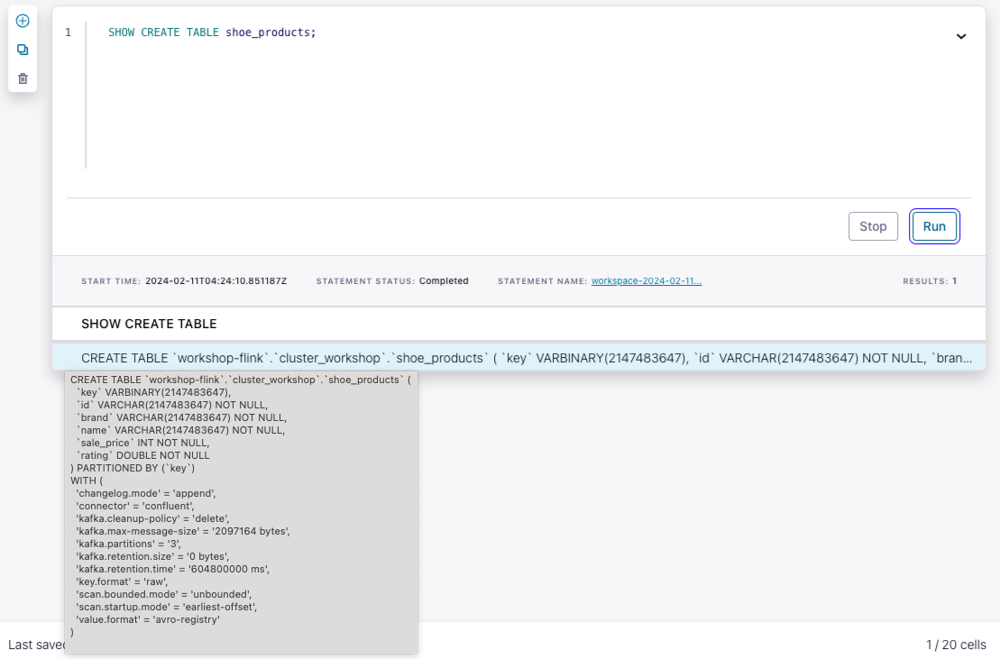

<div align="center" padding=25px>
    
</div>

# <div align="center">Confluent Data Streming 101 - Kafka,Connect,Schema,Flink </div>
## <div align="center">Lab Guide</div>
<br>

## **Agenda**
1. [Log Into Confluent Cloud](#step-1)
1. [Create an Environment and Cluster](#step-2)
1. [Create Flink Compute Pool](#step-3)
1. [Create a Topic using the Cloud UI](#step-4)
1. [Create an API Key Pair](#step-5)
1. [Setup Datagen Connectors](#step-6)
1. [Cloud Dashboard Walkthrough](#step-7)
1. [Flink Basics](#step-8)
1. [Stream Processing with Flink](#step-9)
1. [Connect Redshift sink to Confluent Cloud](#step-10)
1. [Clean Up Resources](#step-11)
1. [Confluent Resources and Further Testing](#confluent-resources-and-further-testing)

***

## **Architecture Diagram**

<div align="center">
    
</div>

This workshop will be utilizing confluent Datagen, Redshift, flink instances that are being managed by Confluent. You will not be able to access these instances outside of the workshop time.  To test Flink and connectors outside of the workshop you can take a look at the flink [quickstart]([https://docs.confluent.io/cloud/current/get-started/ksql.html](https://docs.confluent.io/cloud/current/flink/get-started/quick-start-cloud-console.html)) and fully-managed connectors [page](https://docs.confluent.io/cloud/current/connectors/index.html#kafka-connect-cloud).
***

## **Prerequisites**

1. Confluent Cloud Account
    * Sign-up for a Confluent Cloud account [here](https://www.confluent.io/confluent-cloud/tryfree/).
    * Once you have signed up and logged in, click on the menu icon at the upper right hand corner, click on “Billing & payment”, then enter the PROMOCODE provided during the workshop.

    > **Note:** You will create resources during this workshop that will incur costs. When you sign up for a Confluent Cloud account, you will get free credits to use in Confluent Cloud. This will cover the cost of resources created during the workshop. More details on the specifics can be found [here](https://www.confluent.io/confluent-cloud/tryfree/).

<div align="center" padding=25px>
    
</div>

***

## **Objective**

In this workshop you will learn how Confluent Cloud can enable you to quickly and easily stand up a streaming ETL pipeline. During this workshop you’ll get hands-on experience with building out an end-to-end ETL pipeline; from extracting & loading data from out-of-the-box source & target systems with connectors to transforming the data in real-time with flink all in Confluent Cloud. The use case will be centered around creating dynamic product promotions based on real-time purchases, inventory levels, and clickstream data applying a number of transformations like filter, aggregate or join on your data streams, and then easily loading it in the destination application, all without having to type a single line of code.

Attendees will leave with a clear understanding of their upcoming ETL implementation, how to get started with Confluent Cloud, and the resources available to assist with development.

This workshop is perfect for those looking to build the foundation for your data processing pipeline and ETL use cases and to get started with Confluent Cloud. This is also a great session to ask the engineers your questions and participate in a forum with other attendees who already use Confluent Cloud or plan to use Confluent Cloud.

***

## <a name="step-1"></a>Log into Confluent Cloud

1. Log into [Confluent Cloud](https://confluent.cloud) and enter your email and password.

<div align="center" padding=25px>
    
</div>

2. If you are logging in for the first time, you will see a self-guided wizard that walks you through spinning up a cluster. Please minimize this as you will walk through those steps in this workshop. 

***

## <a name="step-2"></a>Create an Environment and Cluster

An environment contains clusters and its deployed components such as Apache Flink, Connectors, ksqlDB, and Schema Registry. You have the ability to create different environments based on your company's requirements. For example, you can use environments to separate Development/Testing, Pre-Production, and Production clusters.

1. Click the **+ Add cloud environment** button and a modal will appear.
2. Enter an **Environment Name**, like `stream-processing-workshop`.
3. Select **Essentials** under *Stream Governance package* and click **Create**.

> [!Note]
> There is a *default* environment ready in your account upon account creation. You can use this *default* environment for the purpose of this workshop if you do not wish to create an additional environment.

<div align="center" padding=25px>
    
</div>


4. Select the `Basic` cluster type
5. Choose `AWS` as your provider
6. Select `Mumbai` as the region and `Single Zone` as the availability and enter a cluster name as `Confluent101` and click on **Create Cluster**.
7. Click **Launch Cluster**.

> [!Note]
> **Confluent Cluster Types**
>
> Confluent Cloud clusters are available in 5 types: *Basic*, *Standard*, *Enterprise*, *Dedicated*, and *Freight*. `Basic` is intended for development use cases so you will use that for this workshop.
>
> If you are interested in learning more about the different types of clusters and their associated features and limits, refer to this [documentation](https://docs.confluent.io/current/cloud/clusters/cluster-types.html).

## <a name="step-3"></a>Create a Flink Compute Pool

1. Click on the link with your environment name in the navigation bookmark links at the top left of your screen.
2. Select the **Flink** tab and click **Create Compute Pool**.

<div align="center" padding=25px>
    
</div>

3. Select `AWS` as cloud and `Mumbai` as the **Region** and then click **Continue**.

<div align="center" padding=25px>
    
</div>

4. Enter a name for your pool (e.g. `flink-workshop-pool`) and click **Create**.

<div align="center" padding=25px>
    
</div>

> [!Note]
> **Compute Pool Capacity**
>
> The capacity of a compute pool is measured in CFUs. Compute pools expand and shrink automatically based on the resources required by the statements using them.
>
> A compute pool without any running statements scale down to zero. The maximum size of a compute pool is configured during creation.

5. Flink Compute pools will be ready shortly. You can click **Open SQL workspace** button when the pool is ready to use.

6. There are two *Use* labels above the Flink query window. For the left-most *Use* label, click the dropdown and select your new environment.
7. For the right-most *Use* label, click the dropdown and select your cluster.

<div align="center" padding=25px>
    
</div>

***

## <a name="step-4"></a>Step 4: Create a Topic using the Cloud UI

1. On the navigation menu, select **Topics** and click **Create Topic**.
    > **Note:** Refresh the page if your cluster is still spinning up.

1. Enter **Shoe_Customers** as the Topic name and **3** as the Number of partitions
    > **Note:** Topics have many configurable parameters that dictate how Confluent handles messages. A complete list of those configurations for Confluent Cloud can be found [here](https://docs.confluent.io/cloud/current/using/broker-config.html).  If you’re interested in viewing the default configurations, you can view them in the *Topic Summary* on the right side.

1. Click **Create with defaults**.

1. Repeat the steps for two other topics **Shoe_Orders** and **Shoe_Products**.

***


## <a name="step-5"></a>Step 5: Create an API Key Pair

1. Select **API keys** on the navigation menu.

1. If this is your first API key within your cluster, click **Create key**. If you have set up API keys in your cluster in the past and already have an existing API key, click **+ Add key**.

1. Select **My Account**, then click Next.

1. Save your API key and secret - you will need these during the workshop.

1. After creating and saving the API key, you will see this API key in the Confluent Cloud UI in the **API keys** tab. If you don’t see the API key populate right away, refresh the browser.

***

## <a name="step-6"></a>Create Datagen Connectors for Customers, Products and Orders

The next step is to produce sample data using the Datagen Source connector. You will create three Datagen Source connectors. One connector will send sample customer data to **shoe_customers** topic, the other connector will send sample product data to **shoe_products** topic, and final connector will send sample order data to **shoe_orders** topic.

1. First, you will create the connector that will send data to **shoe_customers**. From the Confluent Cloud UI, click on the **Connectors** tab on the navigation menu. Click on the **Datagen Source** icon.

<div align="center" padding=25px>
    
</div>

2. Enter the following configuration details. The remaining fields can be left blank.

<div align="center">

| setting                            | value                        |
|------------------------------------|------------------------------|
| name                               | DatagenSourceConnector_shoe_customers |
| api key                            | [*from step 5* ](#step-5)    |
| api secret                         | [*from step 5* ](#step-5)    |
| topic                              | shoe_customers               |
| output message format              | AVRO                         |
| quickstart                         | Shoe customers               |
| max interval between messages (ms) | 1000                         |
| tasks                              | 1                            |
</div>

<br>

<div align="center" padding=25px>
    
    
</div>

3. Click on **Show advanced configurations** and complete the necessary fields and click **Continue**.

<div align="center" padding=25px>
    
</div>
   
4. Before launching the connector, you should see something similar to the following. If everything looks similar, select **Launch**. 

<div align="center" padding=25px>
    
</div>

5. Next, create the second connector that will send data to **shoe_products**. Click on **+ Add Connector** and then the **datagen Source** icon again. 

6. Enter the following configuration details. The remaining fields can be left blank. 

<div align="center">

| setting                            | value                        |
|------------------------------------|------------------------------|
| name                               | DatagenSourceConnector_shoe_products |
| api key                            | [*from step 5* ](#step-5)    |
| api secret                         | [*from step 5* ](#step-5)    |
| topic                              | shoe_products                |
| output message format              | AVRO                         |
| quickstart                         | Shoes                        |
| max interval between messages (ms) | 1000                         |
| tasks                              | 1                            |
</div>

<br> 

7. Review the output again and then select **Launch**.

8. Next, create the second connector that will send data to **shoe_orders**. Click on **+ Add Connector** and then the **datagen Source** icon again. 

9. Enter the following configuration details. The remaining fields can be left blank. 

<div align="center">

| setting                            | value                        |
|------------------------------------|------------------------------|
| name                               | DatagenSourceConnector_shoe_orders |
| api key                            | [*from step 5* ](#step-5)    |
| api secret                         | [*from step 5* ](#step-5)    |
| topic                              | shoe_orders                  |
| output message format              | AVRO                         |
| quickstart                         | Shoe orders                  |
| max interval between messages (ms) | 1000                         |
| tasks                              | 1                            |
</div>

<br> 

10. Review the output again and then select **Launch**.

> **Note:** It may take a few moments for the connectors to launch. Check the status and when both are ready, the status should show *running*. <br> <div align="center"></div>

> **Note:** If the connectors fails, there are a few different ways to troubleshoot the error:
> * Click on the *Connector Name*. You will see a play and pause button on this page. Click on the play button.
> * Click on the *Connector Name*, go to *Settings*, and re-enter your API key and secret. Double check there are no extra spaces at the beginning or end of the key and secret that you may have accidentally copied and pasted.
> * If neither of these steps work, try creating another Datagen connector.


11. You can view the sample data flowing into topics in real time. Navigate to  the **Topics** tab and then click on the **shoe_customers**. You can view the production and consumption throughput metrics here.

12. Click on **Messages**.

* You should now be able to see the messages within the UI. You can view the specific messages by clicking the icon. 

<div align="center">
    
</div> 

* The message details should look something like the following. 

<div align="center">
    
</div>

***

## <a name="step-7"></a>Step 7: Cloud Dashboard Walkthrough

This section will be conducted by the workshop instructor.  You can find additional information on the Cloud Dashboard [here](https://docs.confluent.io/cloud/current/overview.html) and [here](https://docs.confluent.io/cloud/current/client-apps/cloud-basics.html).

***
## <a name="step-8"></a>Step 8:  Flink Basics
Kafka topics and schemas are always in sync with our Flink cluster. Any topic created in Kafka is visible directly as a table in Flink, and any table created in Flink is visible as a topic in Kafka. Effectively, Flink provides a SQL interface on top of Confluent Cloud.

Following mappings exist:
| Kafka          | Flink     | 
| ------------   | --------- |
| Environment    | Catalog   | 
| Cluster        | Database  |
| Topic + Schema | Table     |

1. Familiarize with **Flink SQL** Basics.
```sql
SHOW CATALOGS;
```

```
SHOW DATABASES;
```

```sql
SHOW TABLES;
```
<div align="center">
    
</div>

Understand how the table `shoe_products` was created:

```sql
SHOW CREATE TABLE shoe_products;
```

<div align="center">
    
</div>

You can find more information about all DDL Statements [here.](https://docs.confluent.io/cloud/current/flink/reference/statements/overview.html)

Let us first check the table schema for our `shoe_products` catalog. This should be the same as the topic schema in Schema Registry.
```sql
DESCRIBE shoe_products;
```

2. Let's check if any product records exist in the table.
```sql
SELECT * FROM shoe_products;
```

3. Check if the `shoe_customers` schema  exists. 
```sql
DESCRIBE shoe_customers;
```


***
## <a name="step-8"></a>Step 8: Create Streams and Tables using flink

Now that you have data flowing through Confluent, you can now easily build stream processing applications using flink. You are able to continuously transform, enrich, join, and aggregate your data using simple SQL syntax. You can gain value from your data directly from Confluent in real-time. Also, flink is a fully managed service within Confluent Cloud with a 99.9% uptime SLA. You can now focus on developing services and building your data pipeline while letting Confluent manage your resources for you.

With flink, you have the ability to leverage streams and tables from your topics in Confluent. A stream in flink is a topic with a schema and it records the history of what has happened in the world as a sequence of events. Tables are similar to traditional RDBMS tables. If you’re interested in learning more about flink and the differences between streams and tables, I recommend reading these two blogs [here](https://www.confluent.io/blog/kafka-streams-tables-part-3-event-processing-fundamentals/) and [here](https://www.confluent.io/blog/how-real-time-stream-processing-works-with-flink/).

1. Navigate back to the flink tab and click on your application name. This will bring us to the flink editor.

>**Note:** You can interact with flink through the Editor. You can create a stream by using the CREATE STREAM statement and a table using the CREATE TABLE statement.

To write streaming queries against topics, you will need to register the topics with flink as a stream and/or table.

2. First, create a **Stream** by registering the **abc.clicks** topic as a stream called **clicks**

    * Insert the following query into the flink editor and click ‘**Run query**’ to execute

```SQL
CREATE STREAM clicks(
    ip VARCHAR,
    userid INT,
    prod_id INT,
    bytes BIGINT,
    referrer VARCHAR,
    agent VARCHAR,
    click_ts BIGINT
    )
WITH (
    KAFKA_TOPIC='abc.clicks',
    VALUE_FORMAT='JSON',
    TIMESTAMP='click_ts'
);
```

3. Create another **Stream** by registering the **abc.transactions** topic as a stream called **transactions**

```sql
CREATE STREAM transactions (
  fullDocument STRUCT<
    cust_id INT,
    prod_id INT,
    txn_ts BIGINT>)
  WITH (
    KAFKA_TOPIC='abc.transactions',
    VALUE_FORMAT='JSON'
  );
```

4. Create another **Stream** by registering the **abc.inventory** topic as a stream called **inventory00**

```SQL
CREATE STREAM inventory00 (
  fullDocument STRUCT<
    product_id INT,
    name VARCHAR,
    "list" INT,
    discount INT,
    available INT,
    capacity INT,
    txn_hour INT>)
  WITH (
    KAFKA_TOPIC='abc.inventory',
    VALUE_FORMAT='JSON'
  );
```

5. Create an **inventory Table** based on the **inventory00** stream that you just created
    * Make sure to set ‘auto.offset.reset’ = ‘earliest’ first
    * This is a Persistent Query.  A Persistent Query runs indefinitely as it processes rows of events and writes to a new topic. You can create persistent queries by deriving new streams and new tables from existing streams or tables.

```SQL
CREATE TABLE INVENTORY AS
  SELECT
FULLDOCUMENT->PRODUCT_ID AS PRODUCT_ID,
LATEST_BY_OFFSET(FULLDOCUMENT->NAME) AS NAME,
LATEST_BY_OFFSET(FULLDOCUMENT->"list") AS LIST_PRICE,
LATEST_BY_OFFSET(FULLDOCUMENT->DISCOUNT) AS DISCOUNT,
LATEST_BY_OFFSET(FULLDOCUMENT->AVAILABLE) AS AVAILABLE,
LATEST_BY_OFFSET(FULLDOCUMENT->CAPACITY) AS CAPACITY,
LATEST_BY_OFFSET(FULLDOCUMENT->TXN_HOUR) AS TXN_HOUR
FROM INVENTORY00
GROUP BY FULLDOCUMENT->PRODUCT_ID;
```

6. Next, go to the **Tables** tab at the top and click on **INVENTORY**. This provides information on the table, topic (including replication, partitions, and key and value serialization), and schemas.

7. Click on **Query table** which will take you back to the **Editor**. You will see the following query auto-populated in the editor which may be already running by default. If not, click on **Run query**. An option is to set the ‘auto.offset.reset=earliest’ before clicking **Run query**.

Optionally, you can navigate to the editor and construct the select statement on your own, which should look like the following:

```SQL
SELECT * FROM INVENTORY EMIT CHANGES;
```

8. You should see the following data within your **INVENTORY** table.

9. Stop the query by clicking **Stop**


***

## <a name="step-9"></a>Step 9: Stream Processing with flink

1. Create a **PRODUCT_TXN_PER_HOUR** table based on the **INVENTORY** table and **TRANSACTIONS** stream.  Make sure to first set 'auto.offset.reset' = 'earliest' before running the query.

```SQL
CREATE TABLE PRODUCT_TXN_PER_HOUR WITH (FORMAT='AVRO') AS
SELECT T.FULLDOCUMENT->PROD_ID,
       COUNT(*) AS TXN_PER_HOUR,
       MAX(I.TXN_HOUR) AS EXPECTED_TXN_PER_HOUR,
       (CAST(MAX(I.AVAILABLE) AS DOUBLE)/ CAST(MAX(I.CAPACITY) AS DOUBLE))*100 AS STOCK_LEVEL, I.NAME AS PRODUCT_NAME
FROM  TRANSACTIONS T
      LEFT JOIN INVENTORY I
      ON T.FULLDOCUMENT->PROD_ID = I.PRODUCT_ID
WINDOW HOPPING (SIZE 1 HOUR, ADVANCE BY 5 MINUTES)
GROUP BY T.FULLDOCUMENT->PROD_ID,
         I.NAME;
```

2. Create a stream on the underlying topic backing the **PRODUCT_TXN_PER_HOUR** table that you just created
    * Determine the name of the backing topic by navigating to the **Topics** tab on the left hand side menu under **Cluster**.  You should see a topic that begins with **pksqlc-**… and ends with **PRODUCT_TXN_PER_HOUR**. Click on this topic and copy down this topic name as it will be required for the following query
    * Create the stream based on the backing topic for PRODUCT_TXN_PER_HOUR table

```SQL
CREATE STREAM PRODUCT_TXN_PER_HOUR_STREAM WITH (KAFKA_TOPIC='pksqlc-...PRODUCT_TXN_PER_HOUR', FORMAT='AVRO');
```

3. Now you want to perform a query to see which products you should create promotions for based on the following criteria
    * High inventory level (>80% of capacity)
    * Low transactions (< expected transactions/hour)

```SQL
CREATE STREAM ABC_PROMOTIONS AS
SELECT  ROWKEY,
        TIMESTAMPTOSTRING(ROWTIME,'yyyy-MM-dd HH:mm:ss','Europe/London') AS TS,
        AS_VALUE(ROWKEY -> PROD_ID) AS PROD_ID ,
        ROWKEY -> PRODUCT_NAME AS PRODUCT_NAME,
        STOCK_LEVEL ,
        TXN_PER_HOUR ,
        EXPECTED_TXN_PER_HOUR
   FROM PRODUCT_TXN_PER_HOUR_STREAM
WHERE TXN_PER_HOUR < EXPECTED_TXN_PER_HOUR
  AND  STOCK_LEVEL > 80
  ;
```

4. Query the results.  Make sure to set ‘auto.offset.reset=earliest’

```SQL
SELECT * FROM ABC_PROMOTIONS EMIT CHANGES;
```

***

## <a name="step-10"></a>Step 10: Connect Redshift sink to Confluent Cloud

The next step is to sink data from Confluent Cloud into Redshift using the [fully-managed Redshift Sink connector](https://docs.confluent.io/cloud/current/connectors/cc-AWS-Redshift-sink.html). The connector will send real time data on promotions into Redshift.

1. First, you will create the connector that will automatically create a Redshift table and populate that table with the data from the promotions topic within Confluent Cloud. From the Confluent Cloud UI, click on the Connectors tab on the navigation menu and select **+Add connector**. Search and click on the Redshift Sink icon.

2. Enter the following configuration details. The remaining fields can be left blank.

<div align="center">

| Setting                | Value                                   |
|------------------------|-----------------------------------------|
| `Topics`               | pksqlc-...ABC_PROMOTIONS                |
| `Name`                 | RedshiftSinkConnector                   |
| `Input message format` | Avro                                    |
| `Kafka API Key`        | From step 6                             |
| `Kafka API Secret`     | From step 6                             |
| `AWS credentials file` | Upload_your_AWS_Credentials_file        |
| `Project ID`           | your AWS Project ID                     |
| `Dataset`              | your AWS Dataset Name                   |
| `Auto create tables`   | True                                    |
| `Tasks`                | 1                                       |

</div>

3. Click on **Next**.

4. Before launching the connector, you will be brought to the summary page.  Once you have reviewed the configs and everything looks good, select **Launch**.

5. This should return you to the main Connectors landing page. Wait for your newly created connector to change status from **Provisioning** to **Running**.

6. Shortly after, the workshop instructor will switch over to the Redshift page within Google Console to show that a table matching the topic name you used when creating the Redshift connector in Confluent Cloud has been created within the **workshop** dataset.  Clicking the table name should open a Redshift editor for it:


***

## <a name="step-11"></a>Step 11: Clean Up Resources

Deleting the resources you created during this workshop will prevent you from incurring additional charges.

1. The first item to delete is the flink application. Select the Delete button under Actions and enter the Application Name to confirm the deletion.

2. Delete the Redshift sink connector by navigating to **Connectors** in the navigation panel, clicking your connector name, then clicking the trash can icon in the upper right and entering the connector name to confirm the deletion.

3. Delete the mongoDB Atlas source connector by navigating to **Connectors** under Cluster in the navigation panel, clicking your connector name, then clicking the trash can icon in the upper right and entering the connector name to confirm the deletion.

4. Delete the Cluster by going to the **Settings** tab and then selecting **Delete cluster**

 5. Delete the Environment by expanding right hand menu and going to **Environments** tab and then clicking on **Delete** for the associated Environment you would like to delete

***

## <a name="confluent-resources-and-further-testing"></a>Confluent Resources and Further Testing

Here are some links to check out if you are interested in further testing:

* Confluent Cloud [Basics](https://docs.confluent.io/cloud/current/client-apps/cloud-basics.html)

* [Quickstart](https://docs.confluent.io/cloud/current/get-started/index.html) with Confluent Cloud

* Confluent Cloud flink [Quickstart](https://docs.confluent.io/cloud/current/get-started/ksql.html)

* Confluent Cloud [Demos/Examples](https://docs.confluent.io/platform/current/tutorials/examples/ccloud/docs/ccloud-demos-overview.html)

* flink [Tutorials](https://kafka-tutorials.confluent.io/)

* Full repository of Connectors within [Confluent Hub](https://www.confluent.io/hub/)
