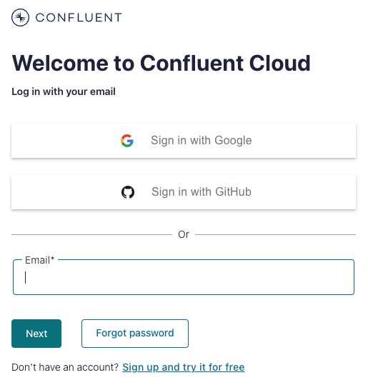
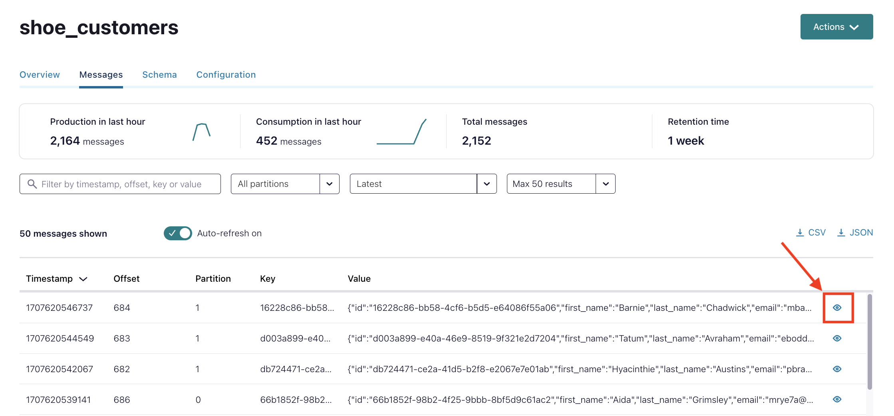
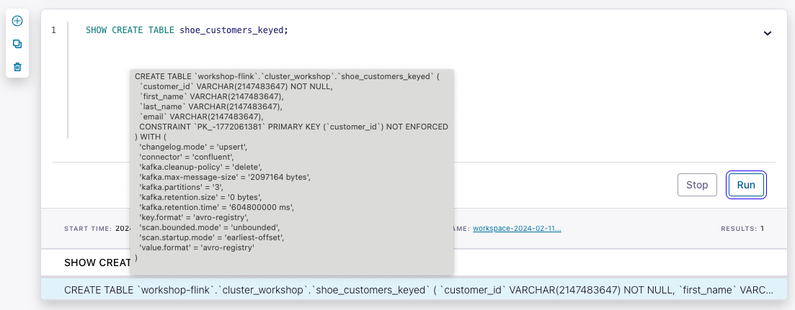

<div align="center" padding=25px>
    
</div>

# <div align="center">Confluent Data Streming 101 - Kafka,Connect,Schema,Flink </div>
## <div align="center">Lab Guide</div>
<br>

## **Agenda**
1. [Log Into Confluent Cloud](#step-1)
1. [Create an Environment and Cluster](#step-2)
1. [Create Flink Compute Pool](#step-3)
1. [Create a Topic using the Cloud UI](#step-4)
1. [Create an API Key Pair](#step-5)
1. [Setup Datagen Connectors](#step-6)
1. [Cloud Dashboard Walkthrough](#step-7)
1. [Stream Processing with Flink](#step-8)
1. [(OPTIONAL) Connect Redshift sink to Confluent Cloud](#step-9)
1. [Clean Up Resources](#step-10)
1. [Confluent Resources and Further Testing](#confluent-resources-and-further-testing)

***

## **Architecture Diagram**

<div align="center">
    
</div>

This workshop will be utilizing confluent Datagen, Redshift, flink instances that are being managed by Confluent. You will not be able to access these instances outside of the workshop time.  To test Flink and connectors outside of the workshop you can take a look at the flink [quickstart](https://docs.confluent.io/cloud/current/get-started/ksql.html) and fully-managed connectors [page](https://docs.confluent.io/cloud/current/connectors/index.html#kafka-connect-cloud).
***

## **Prerequisites**

1. Confluent Cloud Account
    * Sign-up for a Confluent Cloud account [here](https://www.confluent.io/confluent-cloud/tryfree/?utm_campaign=tm.fm-apac_cd.anz-ai-game-day_id.701Uz00000ea25wIAA&utm_medium=workshop).
    * Once you have signed up and logged in, click on the menu icon at the upper right hand corner, click on “Billing & payment”, then enter the PROMOCODE provided during the workshop.

    > **Note:** You will create resources during this workshop that will incur costs. When you sign up for a Confluent Cloud account, you will get free credits to use in Confluent Cloud. This will cover the cost of resources created during the workshop. More details on the specifics can be found [here](https://www.confluent.io/confluent-cloud/tryfree/?utm_campaign=tm.fm-apac_cd.anz-ai-game-day_id.701Uz00000ea25wIAA&utm_medium=workshop).

<div align="center" padding=25px>
    
</div>

***

## **Objective**

In this workshop you will learn how Confluent Cloud can enable you to quickly and easily stand up a streaming ETL pipeline. During this workshop you’ll get hands-on experience with building out an end-to-end ETL pipeline; from extracting & loading data from out-of-the-box source & target systems with connectors to transforming the data in real-time with flink all in Confluent Cloud. The use case will be centered around creating dynamic product promotions based on real-time purchases, inventory levels, and clickstream data applying a number of transformations like filter, aggregate or join on your data streams, and then easily loading it in the destination application, all without having to type a single line of code.

Attendees will leave with a clear understanding of their upcoming ETL implementation, how to get started with Confluent Cloud, and the resources available to assist with development.

This workshop is perfect for those looking to build the foundation for your data processing pipeline and ETL use cases and to get started with Confluent Cloud. This is also a great session to ask the engineers your questions and participate in a forum with other attendees who already use Confluent Cloud or plan to use Confluent Cloud.

***

## <a name="step-1"></a>Log into Confluent Cloud

1. Log into [Confluent Cloud](https://www.confluent.io/confluent-cloud/tryfree/?utm_campaign=tm.fm-apac_cd.anz-ai-game-day_id.701Uz00000ea25wIAA&utm_medium=workshop) and enter your email and password.

<div align="center" padding=25px>
    
</div>

2. If you are logging in for the first time, you will see a self-guided wizard that walks you through spinning up a cluster. Please minimize this as you will walk through those steps in this workshop. 

***

## <a name="step-2"></a>Create an Environment and Cluster

An environment contains clusters and its deployed components such as Apache Flink, Connectors, ksqlDB, and Schema Registry. You have the ability to create different environments based on your company's requirements. For example, you can use environments to separate Development/Testing, Pre-Production, and Production clusters.

1. Click the **+ Add cloud environment** button and a modal will appear.
2. Enter an **Environment Name**, like `stream-processing-workshop`.
3. Select **Essentials** under *Stream Governance package* and click **Create**.

> [!Note]
> There is a *default* environment ready in your account upon account creation. You can use this *default* environment for the purpose of this workshop if you do not wish to create an additional environment.

<div align="center" padding=25px>
    
</div>


4. Select the `Basic` cluster type
5. Choose `AWS` as your provider
6. Select `N. Virginia (us-east-1)` as the region and `Single Zone` as the availability and enter a cluster name as `Confluent101` and click on **Create Cluster**.
7. Click **Launch Cluster**.

> [!Note]
> **Confluent Cluster Types**
>
> Confluent Cloud clusters are available in 5 types: *Basic*, *Standard*, *Enterprise*, *Dedicated*, and *Freight*. `Basic` is intended for development use cases so you will use that for this workshop.
>
> If you are interested in learning more about the different types of clusters and their associated features and limits, refer to this [documentation](https://docs.confluent.io/current/cloud/clusters/cluster-types.html).

## <a name="step-3"></a>Create a Flink Compute Pool

1. Click on the link with your environment name in the navigation bookmark links at the top left of your screen.
2. Select the **Flink** tab and click **Create Compute Pool**.

<div align="center" padding=25px>
    
</div>

3. Select `AWS` as cloud and `N. Virginia (us-east-1)` as the **Region** and then click **Continue**.

<div align="center" padding=25px>
    
</div>

4. Enter a name for your pool (e.g. `flink-workshop-pool`) and click **Create**.

<div align="center" padding=25px>
    
</div>

> [!Note]
> **Compute Pool Capacity**
>
> The capacity of a compute pool is measured in CFUs. Compute pools expand and shrink automatically based on the resources required by the statements using them.
>
> A compute pool without any running statements scale down to zero. The maximum size of a compute pool is configured during creation.

5. Flink Compute pools will be ready shortly. You can click **Open SQL workspace** button when the pool is ready to use.

6. There are two *Use* labels above the Flink query window. For the left-most *Use* label, click the dropdown and select your new environment.
7. For the right-most *Use* label, click the dropdown and select your cluster.

<div align="center" padding=25px>
    
</div>

***

## <a name="step-4"></a>Step 4: Create a Topic using the Cloud UI

1. On the navigation menu, select **Topics** and click **Create Topic**.
    > **Note:** Refresh the page if your cluster is still spinning up.

1. Enter **shoe_customers** as the Topic name and **3** as the Number of partitions
    > **Note:** Topics have many configurable parameters that dictate how Confluent handles messages. A complete list of those configurations for Confluent Cloud can be found [here](https://docs.confluent.io/cloud/current/using/broker-config.html).  If you’re interested in viewing the default configurations, you can view them in the *Topic Summary* on the right side.

1. Click **Create with defaults**.

1. Repeat the steps for two other topics **shoe_orders** and **shoe_products**.

***


## <a name="step-5"></a>Step 5: Create an API Key Pair

1. Select **API keys** on the navigation menu.

1. If this is your first API key within your cluster, click **Create key**. If you have set up API keys in your cluster in the past and already have an existing API key, click **+ Add key**.

1. Select **My Account**, then click Next.

1. Save your API key and secret - you will need these during the workshop.

1. After creating and saving the API key, you will see this API key in the Confluent Cloud UI in the **API keys** tab. If you don’t see the API key populate right away, refresh the browser.

***

## <a name="step-6"></a>Create Datagen Connectors for Customers, Products and Orders

The next step is to produce sample data using the Datagen Source connector. You will create three Datagen Source connectors. One connector will send sample customer data to **shoe_customers** topic, the other connector will send sample product data to **shoe_products** topic, and final connector will send sample order data to **shoe_orders** topic.

1. First, you will create the connector that will send data to **shoe_customers**. From the Confluent Cloud UI, click on the **Connectors** tab on the navigation menu. Click on the **Datagen Source** icon.

<div align="center" padding=25px>
    
</div>

2. click on Additional configuration. 
<div align="center" padding=25px>
    
</div>

3. Enter the following configuration details. The remaining fields can be left blank.

<div align="center">

| setting                            | value                        |
|------------------------------------|------------------------------|
| name                               | DatagenSourceConnector_shoe_customers |
| api key                            | [*from step 5* ](#step-5)    |
| api secret                         | [*from step 5* ](#step-5)    |
| topic                              | shoe_customers               |
| output message format              | AVRO                         |
| sample quickstart schema                         | Shoe customers               |
| tasks                              | 1                            |
</div>

<br>

<div align="center" padding=25px>
    
    
</div>


4. Before launching the connector, you should see something similar to the following. If everything looks similar, select **Launch**. 

<div align="center" padding=25px>
    
</div>

5. Next, create the second connector that will send data to **shoe_products**. Click on **+ Add Connector** and then the **datagen Source** icon again. 

6. Enter the following configuration details. The remaining fields can be left blank. 

<div align="center">

| setting                            | value                        |
|------------------------------------|------------------------------|
| name                               | DatagenSourceConnector_shoe_products |
| api key                            | [*from step 5* ](#step-5)    |
| api secret                         | [*from step 5* ](#step-5)    |
| topic                              | shoe_products                |
| output message format              | AVRO                         |
| sample quickstart schema                        | Shoes                        |
| tasks                              | 1                            |
</div>

<br> 

7. Review the output again and then select **Launch**.

8. Next, create the second connector that will send data to **shoe_orders**. Click on **+ Add Connector** and then the **datagen Source** icon again. 

9. Enter the following configuration details. The remaining fields can be left blank. 

<div align="center">

| setting                            | value                        |
|------------------------------------|------------------------------|
| name                               | DatagenSourceConnector_shoe_orders |
| api key                            | [*from step 5* ](#step-5)    |
| api secret                         | [*from step 5* ](#step-5)    |
| topic                              | shoe_orders                  |
| output message format              | AVRO                         |
| sample quickstart schema                         | Shoe orders                  |
| tasks                              | 1                            |
</div>

<br> 

10. Review the output again and then select **Launch**.

> **Note:** It may take a few moments for the connectors to launch. Check the status and when both are ready, the status should show *running*. <br> <div align="center"></div>

> **Note:** If the connectors fails, there are a few different ways to troubleshoot the error:
> * Click on the *Connector Name*. You will see a play and pause button on this page. Click on the play button.
> * Click on the *Connector Name*, go to *Settings*, and re-enter your API key and secret. Double check there are no extra spaces at the beginning or end of the key and secret that you may have accidentally copied and pasted.
> * If neither of these steps work, try creating another Datagen connector.


11. You can view the sample data flowing into topics in real time. Navigate to  the **Topics** tab and then click on the **shoe_customers**. You can view the production and consumption throughput metrics here.

12. Click on **Messages**.

* You should now be able to see the messages within the UI. You can view the specific messages by clicking the icon. 

<div align="center">
    
</div> 

* The message details should look something like the following. 

<div align="center">
    
</div>

***

## <a name="step-7"></a>Step 7: Cloud Dashboard Walkthrough

This section will be conducted by the workshop instructor.  You can find additional information on the Cloud Dashboard [here](https://docs.confluent.io/cloud/current/overview.html) and [here](https://docs.confluent.io/cloud/current/client-apps/cloud-basics.html).

***

## <a name="step-8"></a>Step 8: Stream Processing with Flink

Kafka topics and schemas are always in sync with our Flink cluster. Any topic created in Kafka is visible directly as a table in Flink, and any table created in Flink is visible as a topic in Kafka. Effectively, Flink provides a SQL interface on top of Confluent Cloud.

Following mappings exist:
| Kafka          | Flink     | 
| ------------   | --------- |
| Environment    | Catalog   | 
| Cluster        | Database  |
| Topic + Schema | Table     |

1. Familiarize with **Flink SQL** Basics.

```sql
SHOW TABLES;
```
<div align="center">
    
</div>

2. Understand how the table `shoe_products` was created:

```sql
SHOW CREATE TABLE shoe_products;
```

<div align="center">
    
</div>

3. Let's check if any product records exist in the table.
```sql
SELECT * FROM shoe_products;
```
***

Windows are central to processing infinite streams. Windows split the stream into “buckets” of finite size, over which you can apply computations. This document focuses on how windowing is performed in Confluent Cloud for Apache Flink and how you can benefit from windowed functions.

Flink provides several window table-valued functions (TVF) to divide the elements of your table into windows, including:

a. [Tumble Windows](https://docs.confluent.io/cloud/current/flink/reference/queries/window-tvf.html#flink-sql-window-tvfs-tumble)
<br> 
b. [Hop Windows](https://docs.confluent.io/cloud/current/flink/reference/queries/window-tvf.html#flink-sql-window-tvfs-hop)
<br> 
c. [Cumulate Windows](https://docs.confluent.io/cloud/current/flink/reference/queries/window-tvf.html#flink-sql-window-tvfs-cumulate)
<br> 

1. Find the amount of orders for one minute intervals (tumbling window aggregation).
```sql
SELECT window_end,
       COUNT(DISTINCT order_id) AS num_orders
FROM TABLE(
  TUMBLE(TABLE shoe_orders, DESCRIPTOR(`$rowtime`), INTERVAL '1' MINUTES))
GROUP BY window_end;
```

<div align="center">
    
</div>

> **Note:** Check this [link](https://docs.confluent.io/cloud/current/flink/reference/queries/window-tvf.html) for the detailed information about Flink Window aggregations.

***
A primary key constraint is a hint for Flink SQL to leverage for optimizations which specifies that a column or a set of columns in a table or a view are unique and they do not contain null. No columns in a primary key can be nullable. A primary key uniquely identifies a row in a table.
For more details please check this [link.](https://docs.confluent.io/cloud/current/flink/reference/statements/create-table.html#primary-key-constraint)

1. Create a new table that will store unique customers only.
```sql
CREATE TABLE shoe_customers_keyed (
  customer_id STRING,
  first_name STRING,
  last_name STRING,
  email STRING,
  PRIMARY KEY (customer_id) NOT ENFORCED
) DISTRIBUTED BY (customer_id) INTO 3 BUCKETS;
```

2. Compare the new table `shoe_customers_keyed` with `shoe_customers`.
```sql
SHOW CREATE TABLE shoe_customers;
```
```sql
SHOW CREATE TABLE shoe_customers_keyed;
```

<div align="center">
    
</div>

By creating a table with Primary Key option, you changed the changelog-mode to upsert which means that all rows with same primary key are related and must be partitioned together.
For more details please check this [link.](https://docs.confluent.io/cloud/current/flink/reference/statements/create-table.html#changelog-mode)

3. Create a new Flink job to copy customer data from the original table to the new table.
```sql
INSERT INTO shoe_customers_keyed
  SELECT id,
         first_name,
         last_name,
         email
    FROM shoe_customers;
```


4. Product Catalog Table also requires unique rows for each item.
Create a new table in order to have the latest information of each product. 
It is useful when you need to know the latest price of the product for analytic purposes or you need to populate latest product information while joining with other tables.
```sql
CREATE TABLE shoe_products_keyed(
  product_id STRING,
  brand STRING,
  `model` STRING,
  sale_price INT,
  rating DOUBLE,
  PRIMARY KEY (product_id) NOT ENFORCED
) DISTRIBUTED BY (product_id) INTO 3 BUCKETS;
```

5. Create a new Flink job to copy product data from the original table to the new table. 
```sql
INSERT INTO shoe_products_keyed
  SELECT id,
         brand,
         `name`,
         sale_price,
         rating 
    FROM shoe_products;
```

Flink supports complex and flexible join operations over dynamic tables. There are a number of different types of joins to account for the wide variety of semantics that queries may require.

By default, the order of joins is not optimized. Tables are joined in the order in which they are specified in the FROM clause.

You can tweak the performance of your join queries, by listing the tables with the lowest update frequency first and the tables with the highest update frequency last. Make sure to specify tables in an order that doesn’t yield a cross join (Cartesian product), which aren’t supported and would cause a query to fail.
For more details please check this [link.](https://docs.confluent.io/cloud/current/flink/reference/queries/joins.html)

6. Enrich Order information with Customer and Product Table.
   Create a new table for enriched order information.
```sql
CREATE TABLE shoe_orders_enriched_customer_product(
  order_id INT,
  first_name STRING,
  last_name STRING,
  email STRING,
  brand STRING,
  `model` STRING,
  sale_price INT,
  rating DOUBLE
) DISTRIBUTED BY (order_id) INTO 3 BUCKETS
WITH (
    'changelog.mode' = 'retract'
);
```

Insert joined data from 3 tables into the new table.
```sql
INSERT INTO shoe_orders_enriched_customer_product(
  order_id,
  first_name,
  last_name,
  email,
  brand,
  `model`,
  sale_price,
  rating)
SELECT
  so.order_id,
  sc.first_name,
  sc.last_name,
  sc.email,
  sp.brand,
  sp.`model`,
  sp.sale_price,
  sp.rating
FROM 
  shoe_orders so
  INNER JOIN shoe_customers_keyed sc 
    ON so.customer_id = sc.customer_id
  INNER JOIN shoe_products_keyed sp
    ON so.product_id = sp.product_id;
```

Verify that the data was joined successfully.
```sql
SELECT * FROM shoe_orders_enriched_customer_product;
```

<div align="center">
    
</div>

***
Customer Loyalty Level Calculation
1. Calculate loyalty levels of each customer
```sql
SELECT
  email,
  SUM(sale_price) AS total,
  CASE
    WHEN SUM(sale_price) > 700000 THEN 'GOLD'
    WHEN SUM(sale_price) > 70000 THEN 'SILVER'
    WHEN SUM(sale_price) > 7000 THEN 'BRONZE'
    ELSE 'CLIMBING'
  END AS loyalty_level
FROM shoe_orders_enriched_customer_product
GROUP BY email;
```

<div align="center">
    
</div>


2. Create a new table that will store the loyalty levels if the customers.
```sql
CREATE TABLE shoe_loyalty_levels(
  email STRING,
  total BIGINT,
  loyalty_level STRING,
  PRIMARY KEY (email) NOT ENFORCED
) DISTRIBUTED BY (email) INTO 3 BUCKETS ;
```

3. Insert the calculated loyal levels into the new table.
```sql
INSERT INTO shoe_loyalty_levels(
 email,
 total,
 loyalty_level)
SELECT
  email,
  SUM(sale_price) AS total,
  CASE
    WHEN SUM(sale_price) > 700000 THEN 'GOLD'
    WHEN SUM(sale_price) > 70000 THEN 'SILVER'
    WHEN SUM(sale_price) > 7000 THEN 'BRONZE'
    ELSE 'CLIMBING'
  END AS loyalty_level
FROM shoe_orders_enriched_customer_product
GROUP BY email;
```

4. Verify the results.
```sql
SELECT *
FROM shoe_loyalty_levels;
```

<div align="center">
    
</div>

***

Create Promotional Campaigns
Create special promotions based on the enriched orders table.
1. Find eligible customers who order **'Jones-Stokes'** shoes **10th time**.
```sql
SELECT
   email,
   COUNT(*) AS total,
   (COUNT(*) % 10) AS sequence,
   (COUNT(*) % 10) = 0 AS next_one_free
FROM shoe_orders_enriched_customer_product
WHERE brand = 'Jones-Stokes'
GROUP BY email;
```

2. Find eligible customers who ordered **'Braun-Bruen'** and **'Will Inc'** in total more than **10**.
```sql
SELECT
   email,
   COLLECT(brand) AS products,
   'bundle_offer' AS promotion_name
FROM shoe_orders_enriched_customer_product
WHERE brand IN ('Braun-Bruen', 'Will Inc')
GROUP BY email
HAVING COUNT(DISTINCT brand) = 2 AND COUNT(brand) > 10;
```

3. Create a table for promotion notifications.
```sql
CREATE TABLE shoe_promotions(
  email STRING,
  promotion_name STRING,
  PRIMARY KEY (email) NOT ENFORCED
) DISTRIBUTED BY (email) INTO 3 BUCKETS;
```

4. Insert all the promotional information to the shoe_promotions table.  
```sql
INSERT INTO shoe_promotions
SELECT
   email,
   'bundle_offer' AS promotion_name
FROM shoe_orders_enriched_customer_product
WHERE brand IN ('Braun-Bruen', 'Will Inc')
GROUP BY email
HAVING COUNT(DISTINCT brand) = 2 AND COUNT(brand) > 10;
```

5. Verify the results.
```sql
SELECT *
FROM shoe_promotions;
```

<div align="center">
    
</div>


***

## <a name="step-10"></a> [OPTIONAL] Step 10: Connect Redshift sink to Confluent Cloud

The next step is to sink data from Confluent Cloud into Redshift using the [fully-managed Redshift Sink connector](https://docs.confluent.io/cloud/current/connectors/cc-amazon-redshift-sink.html). The connector will send real time data on loyalty levels into Redshift.

1. First, you will create the connector that will automatically create a Redshift table and populate that table with the data from the promotions topic within Confluent Cloud. From the Confluent Cloud UI, click on the Connectors tab on the navigation menu and select **+Add connector**. Search and click on the Redshift Sink icon.

2. Enter the following configuration details. The remaining fields can be left blank.

<div align="center">

| Setting                | Value                                   |
|------------------------|-----------------------------------------|
| `Topics`               | shoe_loyalty_levels                |
| `Name`                 | RedshiftSinkConnector                   |
| `AWS Redshift domain`	 | redhisft_endpoint                     |
|  `AWS Redshift port`	| 5439|
|`Connection user`	|admin username|
|`Connection password`|admin password|	
|`Database name`	|dev(default)|
| `Input message format` | Avro                                    |
| `Kafka API Key`        | From step 5                             |
| `Kafka API Secret`     | From step 5                             |
| `Auto create tables`   | True                                    |
|`Auto add columns` | True|	
| `Tasks`                | 1                                       |

</div>

3. Click on **Next**.

4. Before launching the connector, you will be brought to the summary page.  Once you have reviewed the configs and everything looks good, select **Launch**.

5. This should return you to the main Connectors landing page. Wait for your newly created connector to change status from **Provisioning** to **Running**.

6. Shortly after, the workshop instructor will switch over to the Redshift page within AWS Console to show that a table matching the topic name you used when creating the Redshift connector in Confluent Cloud has been created within the **workshop** dataset.  Clicking the table name should open a Redshift editor for it. The output should look like the below picture.

   
<div align="center">
    
</div>


***

## <a name="step-11"></a>Step 11: Clean Up Resources

Deleting the resources you created during this workshop will prevent you from incurring additional charges.

1. The first item to delete is the flink application. Select the Delete button under Actions and enter the Application Name to confirm the deletion.

2. Delete the Redshift sink connector by navigating to **Connectors** in the navigation panel, clicking your connector name, then clicking the trash can icon in the upper right and entering the connector name to confirm the deletion.

3. Delete the Datagen source connectors by navigating to **Connectors** under Cluster in the navigation panel, clicking your connector name, then clicking the trash can icon in the upper right and entering the connector name to confirm the deletion.

4. Delete the Cluster by going to the **Settings** tab and then selecting **Delete cluster**

 5. Delete the Environment by expanding right hand menu and going to **Environments** tab and then clicking on **Delete** for the associated Environment you would like to delete

***

## <a name="confluent-resources-and-further-testing"></a>Confluent Resources and Further Testing

Here are some links to check out if you are interested in further testing:

* Confluent Cloud [Basics](https://docs.confluent.io/cloud/current/client-apps/cloud-basics.html)

* [Quickstart](https://docs.confluent.io/cloud/current/get-started/index.html) with Confluent Cloud

* Confluent Cloud flink [Quickstart](https://docs.confluent.io/cloud/current/get-started/ksql.html)

* Confluent Cloud [Demos/Examples](https://docs.confluent.io/platform/current/tutorials/examples/ccloud/docs/ccloud-demos-overview.html)

* flink [Tutorials](https://kafka-tutorials.confluent.io/)

* Full repository of Connectors within [Confluent Hub](https://www.confluent.io/hub/)
