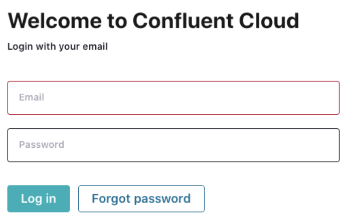
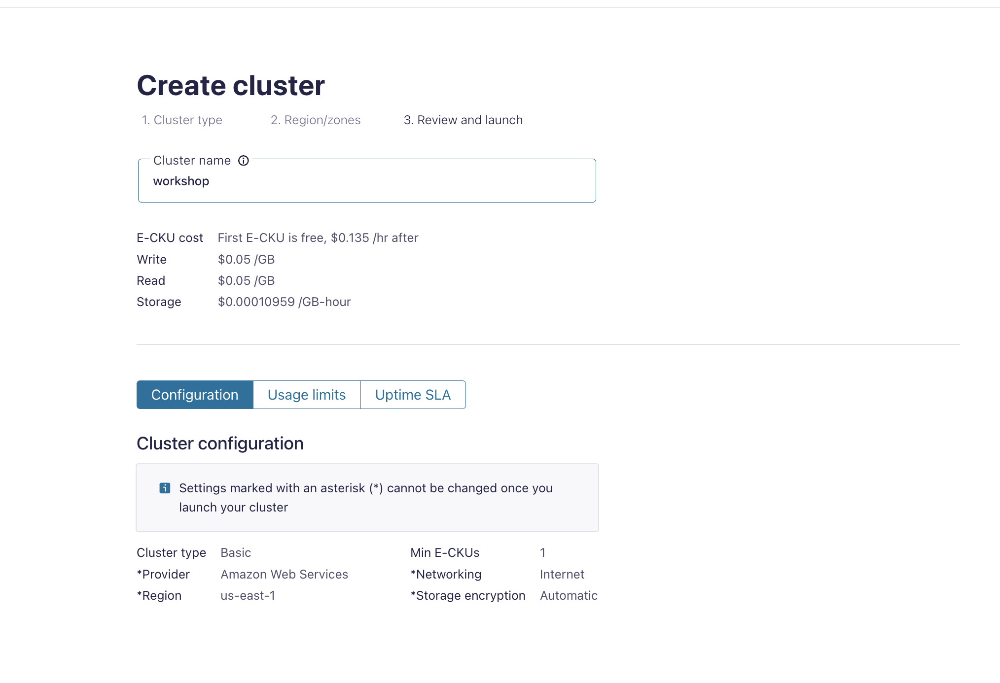

## Log into Confluent Cloud

1. Log into [Confluent Cloud](https://confluent.cloud) and enter your email and password.

    

2. If you are logging in for the first time, you will see a self-guided wizard that walks you through spinning up a cluster. Please minimize this as you will walk through those steps in this workshop. 

***

## Create an Environment and Cluster

An environment contains clusters and its deployed components such as Apache Flink, Connectors, ksqlDB, and Schema Registry. You have the ability to create different environments based on your company's requirements. For example, you can use environments to separate Development/Testing, Pre-Production, and Production clusters. 

1. Click **+ Add Environment**. Specify an **Environment Name** and Click **Create**. 

>**Note:** There is a *default* environment ready in your account upon account creation. You can use this *default* environment for the purpose of this workshop if you do not wish to create an additional environment.

    

2. Now that you have an environment, click **Create Cluster**. 

> **Note:** Confluent Cloud clusters are available in 5 types: Basic, Standard, Enterprise, Dedicated and Freight. Basic is intended for development use cases so you can use that for the workshop. Basic clusters only support single zone availability. Standard and Dedicated clusters are intended for production use and support Multi-zone deployments. If you are interested in learning more about the different types of clusters and their associated features and limits, refer to this [documentation](https://docs.confluent.io/current/cloud/clusters/cluster-types.html).

3. Chose the **Basic** cluster type. 

    

4. Click **Begin Configuration**. 
5. Choose your preferred Cloud Provider (AWS, GCP, or Azure), region, and availability zone. 
6. Specify a **Cluster Name**. For the purpose of this lab, any name will work here. 

    

7. View the associated *Configuration & Cost*, *Usage Limits*, and *Uptime SLA* information before launching. 
8. Click **Launch Cluster**. 

***

## Creates Topics
>**Note:** For this workshop, we want to have a topic with schema, so we will create it using the Sample Data (Datagen) connector.RetryClaude can make mistakes. Please double-check responses.

1. On the navigation menu, select **Connectors** and click **Add plugin**.

2. In the connector catalog, locate and click on **Sample Data** connector (Datagen Source).

    

3. Click **Get started** to launch the Sample Data connector setup.

4. In the "Launch Sample Data" dialog:
   - Select **Users**
   - Click **Launch**

    

5. The connector will show as launched and begin provisioning.

    

6. Navigate to **Topics** in the left menu to verify the **sample_data_users** topic was created with the generated schema and data.

    

> **Note:** Using the Sample Data connector automatically creates topics with predefined schemas and starts generating realistic test data. This eliminates the need for manual topic creation and provides immediate data flow for testing. The connector generates data continuously, which you can monitor in the Topics UI.

***

